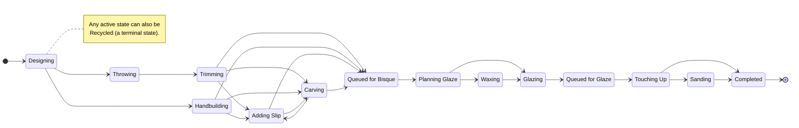
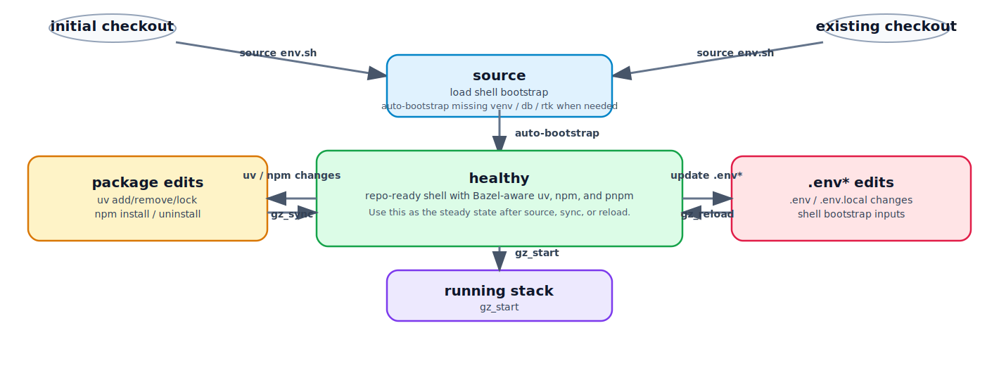

# PotterDoc

[](https://github.com/shaoster/glaze/actions/workflows/ci.yml)
[](https://codecov.io/gh/shaoster/glaze)

PotterDoc is the external product name for this app.
The repository, internal code identifiers, and some contributor documentation still use `glaze` as the internal project name during the transition.

A pottery workflow tracking application. Log pieces and record state transitions as work moves through throwing, bisque firing, glazing, and finishing.

PotterDoc is **pseudonymous by design**: the only identifier we store is a hashed OpenID from your identity provider — no email, name, or avatar. Even admin email invites are sent without ever persisting the recipient address. See the in-app privacy policy for the full story, including the few honest caveats.

**Try it live: [potterdoc.com](https://potterdoc.com)**

<!-- Illustrative overview of the default workflow. Source of truth is workflow.yml;
     regenerate this if states or transitions change. -->



Pieces don't have to march straight through — you can carve before or after slipping, skip waxing, or recycle a piece at any active stage. The diagram above is illustrative; [`workflow.yml`](workflow.yml) is the source of truth.

## Motivation

While the UI is similar at a surface level to other craft journaling applications, the main differences are under the hood:

- Customizable, potentially non-linear workflows. For some pieces you'll carve first, for others you'll slip first. For others, there might be multiple rounds of each.
- Opinionated data model with immutable stage data for your piece's unique journey and your growth-minded journey as a potter. You can't change the past, so keep moving forward. (Administrative bulk data cleaning is still allowed! And when you find a photo from an earlier stage later, the **rewind** feature lets you navigate back to that historical state to attach it — without altering the piece's actual history.)
- Data normalization around every piece's history for richer and more reliable single piece and multi-piece analysis.
- Systematically answer questions like "How many pieces do I lose in the firing stage by glaze type?" or "How often do I ruin a piece during trimming?"

## Ways to contribute

There are three distinct ways to get involved, and they involve different levels of access and commitment. Pick the one that matches your goal — each points to the setup it needs elsewhere in this README.

### Maintaining potterdoc.com

If you want to help run the live service — monitoring, deployments, responding to issues — you need Tailscale access to the production cluster. Send a note to [admin@potterdoc.com](mailto:admin@potterdoc.com) and request access. Once you've been added to the tailnet and have [installed Tailscale](https://tailscale.com/download) on your machine, run:

```bash
tools/init_env.sh
```

This initializes your local `.env.local` with production service credentials pulled directly from the cluster. From there you have everything you need to run the app locally against real credentials, deploy to the cluster, and participate in on-call rotation. This is the path if you care about the pottery community using potterdoc.com specifically and want shared ownership of that instance.

### Contributing to the open source project

If you want to contribute code, documentation, or agent workflows to the Glaze codebase — bug fixes, new features, workflow improvements — you do not need Tailscale access or production credentials. Clone the repo, follow the [Getting started](#getting-started) steps, and open a PR. The local SQLite dev environment is sufficient for most development work. Cloudinary and Google OAuth degrade gracefully when absent (see `.env.example` comments). This is the path if you want to improve the software itself regardless of who hosts it.

### Self-hosting

If you want to run your own instance of PotterDoc for yourself or your studio, you also do not need access to potterdoc.com infrastructure. The codebase is public. You can deploy it using one of two options:
- **Docker Compose**: A completely self-contained deployment setup that includes PostgreSQL, Redis, Celery, and Nginx with Let's Encrypt SSL. Perfect for deploying locally or to a standard virtual machine (VM). See the [Docker Compose Deployment Guide](infra/custom/README.md) for step-by-step instructions.
- **k3s / Kubernetes (Helm)**: Our production deployment configuration, using a Helm chart that deploys to a k3s cluster. See [`docs/ci-cd.md`](docs/ci-cd.md) for cluster deployment details.

This gives you full control over your own data and infrastructure.

## Architecture and tech stack

This guide assumes you already know the tools listed below and are familiar with [separation of concerns](https://en.wikipedia.org/wiki/Separation_of_concerns) and [abstraction](<https://en.wikipedia.org/wiki/Abstraction_(computer_science)>) as design principles; if any term is unfamiliar, click the linked docs to catch up quickly.

- **[Django](https://www.djangoproject.com/)** is the Python web framework that owns the backend (`backend/`, `api/`). [Separation of concerns](https://en.wikipedia.org/wiki/Separation_of_concerns) keeps unrelated responsibilities apart so each layer stays simpler to reason about—for example, [`api/models.py`](api/models.py) defines the data schema, [`api/serializers.py`](api/serializers.py) translates between ORM objects and JSON payloads, and [`api/views.py`](api/views.py) wires those serializers into `/api/...` endpoints that enforce workflow rules from [`workflow.yml`](workflow.yml). That split keeps the REST API (powered by Django REST Framework, DRF) resilient even when one layer needs to change, while returning consistent data/validation to all clients.
- **[React](https://react.dev/)** (web/src/) renders the SPA (Single Page Application) and consumes shared types/API helpers from [`web/src/util/types.ts`](web/src/util/types.ts) and [`web/src/util/api.ts`](web/src/util/api.ts). React follows a component-based paradigm where functions or classes receive props (inputs) and return HTML that the browser can render.
- **[Vite](https://vitejs.dev/)** (web tooling) bundles the React app. It provides fast dev reloads (hot module replacement) so UI changes appear immediately while you work, runs the local dev server that powers our web workbench, and produces optimized production builds (tree shaking, minification) so the deployed bundle is as small and performant as possible.
- **[Material UI](https://mui.com/)** supplies the component library used everywhere in the UI for forms, dialogs, buttons, and layout.
- **[Axios](https://axios-http.com/)** is the HTTP client library we use in the web to talk to REST APIs; it keeps things simple by handling the details of sending and receiving JSON so the UI code does not have to repeat that work. Benefits of Axios over raw `fetch` include centralized configuration of base URLs and headers, automatic JSON parsing/serialization, and built-in hooks for handling errors, cancellations, and retries. In this project that means [`WorkflowState.tsx`](web/src/components/WorkflowState.tsx) can rely on helpers like `updateCurrentState`/`updatePiece` instead of duplicating URLs or JSON logic, and we have a single place for surfaces errors before they hit the UI.
- A **[client library](<https://en.wikipedia.org/wiki/Library_(computing)>)** is a reusable set of functions that wraps low-level protocols (like HTTP) so developers can interact with remote services using clean function calls, in their programming language of choice, instead of handling bytes, headers, or parsing manually.

See [Project structure](#project-structure) for the directory layout and [Further reading](#further-reading) for the per-subsystem documentation.

## Getting started

### Prerequisites

Before cloning, ensure the following are installed on your system:

| Tool                                               | Required                                                                          | Install                                                                                         |
| -------------------------------------------------- | --------------------------------------------------------------------------------- | ----------------------------------------------------------------------------------------------- |
| OS                                                 | Ubuntu 22.04+ or Debian 12+ (WSL2 on Windows works; macOS untested)               | —                                                                                               |
| [Bazelisk](https://github.com/bazelbuild/bazelisk) | Yes — aliased as `bazel`; downloads Bazel 8.5.1 automatically via `.bazelversion` | [Bazelisk releases](https://github.com/bazelbuild/bazelisk/releases) or `brew install bazelisk` |
| `curl`                                             | Yes — used by the lazy shell bootstrap to install RTK when needed                 | `apt install curl`                                                                              |
| `git`                                              | Yes                                                                               | `apt install git`                                                                               |

Python (3.12) and Node (22) are managed hermetically by Bazel — no manual installs needed once Bazelisk is present.

**VS Code users:** install [Docker Desktop](https://www.docker.com/products/docker-desktop/) (Windows/macOS) or Docker Engine (Linux) and the [Dev Containers extension](https://marketplace.visualstudio.com/items?itemName=ms-vscode-remote.remote-containers), then open the repo and choose **Reopen in Container** — the devcontainer pre-installs all prerequisites automatically.

The devcontainer pre-forwards backend ports `8080–8087` and Vite ports `5173–5180`. These ranges match the authorized origins registered in the Google OAuth client, and support up to 8 simultaneous worktree dev stacks. Running more than 8 concurrent `gz_start` instances inside the container is not supported — use the host environment instead if you need more.

### Quick start

This is for folks who just want to fire up the whole stack quickly and start poking around the app.

```bash
source env.sh
gz_start    # starts backend + web via the Bazel-run launcher
```

The rest of the day-to-day commands live under [Development workflow](#development-workflow).

### Local secrets and config (git-safe)

Keep local-only settings in `.env.local` files; they are gitignored by default:

- `.env.local` (repo-wide defaults)
- `web/.env.local` (web-only overrides)

`source env.sh` automatically loads both (in that order) so you can inject Cloudinary/API config without committing secrets.
Use the checked-in root template, and create `web/.env.local` manually if you
need web-only overrides:

```bash
cp .env.example .env.local
```

If you have Tailscale access to the production cluster, `tools/init_env.sh` does this and also fills in the service credentials in one step (see [Ways to contribute](#ways-to-contribute)).

Each variable in `.env.example` has an inline comment explaining what it enables and what degrades gracefully when it is absent. Keep those comments current whenever a variable is added, removed, or renamed — the file is the primary reference for onboarding and for debugging "why isn't this feature working in dev."

### Manual setup (without `env.sh`)

If you prefer to install dependencies and run servers yourself, follow these explicit commands instead of relying on the helper script.

```bash
# Backend
bazel run @uv//:uv -- sync
bazel run @uv//:uv -- run python manage.py migrate
uvicorn backend.asgi:application --port 8080 --reload

# Web (separate terminal)
cd web
bazel run @nodejs_linux_amd64//:npm -- install
bazel run @nodejs_linux_amd64//:npm -- run dev
```

## Development workflow

The `env.sh` helpers wrap the common CLI sequences so you can focus on implementing features instead of hunting for the right flags.

<figure>
  
  <figcaption>Healthy is the steady state. Fresh and existing checkouts both source <code>env.sh</code>, which lazily bootstraps any missing local shell state on first load. Package edits return to healthy via <code>gz_sync</code>, <code>.env*</code> edits return via <code>gz_reload</code>, and <code>gz_start</code> launches the stack from healthy.</figcaption>
</figure>

The `env.sh` script sets up Python/Node paths, loads useful aliases (`gz_start`, etc.), and keeps environment-specific tweaks (like log rotation and virtualenv activation) centralized, so every developer runs commands against the same configuration without manually sourcing multiple files. On a fresh checkout, `source env.sh` also materializes any missing local bootstrap state needed for a healthy shell.

Source the file to load all shortcuts into your shell:

```bash
source env.sh
```

Run `gz_help` to print the full list of shortcuts at any time.

**VS Code / Cursor:** the repo ships terminal profiles in [`.vscode/settings.json`](.vscode/settings.json) for Linux and macOS that automatically source `env.sh` in every new integrated terminal. Linux uses `bash`; macOS uses `zsh` with a repo-owned [`.vscode/.zshrc`](.vscode/.zshrc). The venv is activated and `gz_*` helpers are available from the moment the terminal opens.

**AI coding agents (Claude Code, Codex, Cursor agent):** a companion script [`env-agent.sh`](env-agent.sh) provides a silent, lightweight bootstrap (venv activation + current-checkout `.env`/`.env.local` loading) for non-interactive shells. Claude Code picks it up via `.claude/settings.json`; Codex and other agents inherit it through `BASH_ENV` when launched from an `env.sh`-sourced terminal. Prefer repo-local worktrees under `.agent-worktrees/...` instead of `/tmp`; the bootstrap detects the active git worktree root automatically and expects the worktree to own its `.env`/`.env.local` files and materialized dependency environment. `env.sh` will lazily create the minimal local bootstrap state needed for a healthy shell on first load, and `gz_reload` refreshes the current shell after shell/bootstrap/env-file edits so the new `PATH` is visible immediately. Keep repo-local Codex-specific config in `.agent-config/codex/` rather than `.codex`, which may be reserved by the local Codex installation. See [`docs/agents/dev.md`](docs/agents/dev.md) for details.

### Shell sync helpers

| Command     | Description                                                                                                                                              |
| ----------- | -------------------------------------------------------------------------------------------------------------------------------------------------------- |
| `gz_sync`   | Reconcile native package-manager edits with the Bazel-aware workflow and refresh the current shell. Use this after `uv` or `npm` dependency changes.     |
| `gz_reload` | Re-source `env.sh` in the current shell after changing shell bootstrap, env files, or freshly materialized tools that should appear on `PATH` right now. |

### Running servers

| Command                  | Description                                                                         |
| ------------------------ | ----------------------------------------------------------------------------------- |
| `gz_start`               | Start backend and web via the Bazel-run launcher. Rotates old logs before starting. |
| `gz_stop`                | Stop both servers.                                                                  |
| `gz_status`              | Show whether backend and web are running.                                           |
| `gz_logs [backend\|web]` | Tail logs. Omit argument to tail both.                                              |

Logs are written to `.dev-logs/` and rotated with a timestamp on each `gz_start`.

### Testing

| Command   | Description                                                                                  |
| --------- | -------------------------------------------------------------------------------------------- |
| `gz_test` | Run all tests via Bazel (`bazel test --test_output=errors //...`) — CI-aligned, incremental. |

Use `gz_test` for the full suite. The per-subsystem READMEs in [Further reading](#further-reading) describe each area in more detail.

### Linting and formatting

| Command   | Description                                                                 |
| --------- | --------------------------------------------------------------------------- |
| `gz_lint` | Run all linters via Bazel (`bazel build --config=lint //...`) — CI-aligned. |

**Before committing** — auto-fix Python formatting and fixable lint issues:

```bash
source env.sh && gz_format
# equivalent to: ruff format . && ruff check --fix .
```

### Managing package dependencies

Use the package managers you already know to edit dependency manifests, then hand the result back to the repo’s Bazel-aware workflow.

**Python**

- Use the repo-local `uv` wrapper from the repo root to edit Python dependencies. `source env.sh` prepends the wrapper directory to `PATH`, and the wrapper dispatches to the Bazel-managed toolchain.
- Typical commands: `uv add`, `uv remove`, `uv lock`, `uv sync`.
- After changing Python packages, run `gz_sync` so the materialized environment and Bazel view stay aligned.

**Web**

- Use the repo-local `npm` wrapper inside [`web/`](web/) to edit JavaScript dependencies. `source env.sh` prepends the wrapper directory to `PATH`, and the wrapper dispatches to the Bazel-managed toolchain.
- After `npm install`, regenerate `web/pnpm-lock.yaml` from `web/package-lock.json` with `pnpm import`.
- The reconciliation step should use the repo-local `pnpm` wrapper so the `pnpm` side stays aligned with CI and Bazel.
- After changing web packages, run `gz_sync` so the current shell and repo locks stay in sync.

**When to use which helper**

- Run `gz_sync` after native `uv` or `npm` dependency changes.
- Run `gz_reload` when shell bootstrap files or env files changed and you only need the current terminal to pick up the new `PATH` immediately.

Standalone dev tooling and the JS tool path (`web/scripts/`, `js_binary` wiring) are documented in [`web/README.md`](web/README.md#javascript-dev-tools). Backend-specific procedures like smoke-testing large download endpoints for memory growth live in [`api/README.md`](api/README.md#smoke-testing-large-downloads).

## Agent workflows

Glaze uses a high-level orchestration workflow inspired by the [Get Shit Done (GSD)](https://github.com/gsd-build/get-shit-done) philosophy, but adapted for non-developer QoL and safety with non-frontier models. (Ah, and about the recent GSD drama — whoops. The good ideas still stand, so we're keeping them.)

1.  **`/dream`**: High-level vision and milestone orchestration. Use this to describe a broad feature or user story. The agent will use Plan Mode to break the vision into logical sub-tasks, create a GitHub Milestone, and spawn sub-agents to author specific specs.
2.  **`/spec`**: Detail-oriented issue authoring. Each sub-task from the dream is turned into a precise GitHub issue with problem motivation, proposed solution, and acceptance criteria.
3.  **`/do`**: Execution. When you want an agent to implement an issue or start a PR-sized change, use the explicit issue flow: `/do #292`.

    For bugs, there is a parallel pair that mirrors `/spec` → `/do`:

    - **`/report`** (the bug analog of `/spec`): Interactive evidence gathering, local reproduction, and filing an issue with validated repro steps.
    - **`/fix`** (the bug analog of `/do`): Takes that reported issue, writes a failing regression test first, implements the minimal fix, verifies, and opens a PR.

4.  **`/pm`**: Session-level communication mode. Use this when the main audience is less technical contributors and you want the assistant to explain choices in terms of user value, trade-offs, and constraints instead of file-by-file edits.

### Async code health skills

The skills above are about getting *new* work into the repo. A second family runs **asynchronously, in bulk, against the codebase as a whole** — not tied to a single issue or PR. Point them at the repo when you want to step back and assess health rather than ship a feature:

- **`/deps`**: Bazel dependency audit. Inspects the `rules_oci` image target plus the test and lint graphs for unexpected dependencies — image bloat, layering violations, a lint target that secretly pulls in production code.
- **`/audit`**: Test performance and flakiness audit. Finds slow, flaky, or redundant tests so the suite stays fast and trustworthy.
- **`/cover`**: Coverage analysis. The point isn't just to chase a higher number — because coverage is computed through Bazel's dependency graph, we can see where coverage is *inappropriate*. A unit test that lights up code it should have mocked is an accidental integration test; a test that mocks the very thing it claims to exercise shows up as a suspicious gap. `/cover` surfaces both, so coverage becomes a signal about *test quality*, not just test quantity.
- **`/stories`**: Storybook coverage. Sweeps the component tree for UI that lacks `.stories.tsx` coverage and populates it, so the published Storybook stays an honest catalog of what's actually in the app — the visual analog of keeping test coverage meaningful.
- **`/docs`**: Documentation coverage. Diffs the codebase against the human-facing READMEs since the last sync and applies the updates, so prose doesn't silently drift from what the code actually does.

These compose: `/deps` tells you what a target actually pulls in, and `/cover` cross-checks that against what the tests actually exercise — together they catch the over-mocked unit test and the accidental integration test from opposite directions, while `/audit` keeps whatever you add fast. Run them periodically (or in CI) and file any findings as `/spec` or `/report` issues to feed back into the `/do` and `/fix` loops.

### Architectural principles for agent work

- **Normative Content in GitHub**: Unlike some agent-first workflows that store state in local markdown files, Glaze keeps all normative requirements and status in **GitHub Issues, Milestones, and PRs**. This minimizes hallucinations from non-frontier models by using GitHub as the source of truth and ensures that the project remains accessible to human non-developer contributors via the standard GitHub UI.
- **Flexible Verification**: Verification can happen **synchronously** (as part of the `/do` cycle where the agent runs tests before pushing) or **asynchronously** in bulk using the `/audit` (performance/flakiness), `/cover` (coverage), and `/deps` (Bazel dependency graph audit) skills.

### Worktree lifecycle

When you run `/do #292`, the agent will create a branch like `issue/292-vibe-coding-flow` and a repo-local worktree like `.agent-worktrees/codex/issue-292-vibe-coding-flow` before it analyzes or edits anything.
The agent should immediately print a copy-friendly line:

```text
Worktree: /home/phil/code/glaze/.agent-worktrees/codex/issue-292-vibe-coding-flow
```

Open a dedicated terminal tab for that worktree and jump into it with:

```bash
gz_cd 292
```

From there, use the normal helpers:

```bash
gz_start
```

Each agent gets its own worktree under `.agent-worktrees/<agent>/...`, and each
issue gets its own branch. Keep one terminal per worktree so `gz_start`,
`gz_stop`, logs, and port files stay scoped to the right code checkout. After the
PR is merged or abandoned, stop the servers and remove the worktree and branch —
the full cleanup sequence and recovery steps are in [`docs/agents/worktrees.md`](docs/agents/worktrees.md).

## Component documentation

Interactive component stories are published to GitHub Pages via Storybook:

**[https://shaoster.github.io/glaze/storybook/](https://shaoster.github.io/glaze/storybook/)**

Run locally with `gz_story`. See [`web/README.md`](web/README.md) for details.

## Deployment and CI/CD

Deployment details, GitHub Actions workflows, environment variables, and the off-cluster Dropbox backup setup live in [`docs/ci-cd.md`](docs/ci-cd.md).
The longer-term Helm/k3s migration checklist is tracked in [issue #547](https://github.com/shaoster/glaze/issues/547).

## Project structure

```
backend/          Django project settings, root URL config
api/              Models, serializers, views, tests
  model_factories.py  Auto-generates GlobalModel subclasses from workflow.yml
web/
  src/
    util/
      generated-types.ts  Auto-generated OpenAPI types (gitignored)
      types.ts            Domain types/constants derived from generated-types.ts
      api.ts              HTTP calls; wire-type → domain-type mapping
      workflow.ts         Workflow helpers loaded from workflow.yml
    components/         React components
    App.tsx             Root component with MUI dark theme
workflow.yml               Source of truth for piece states and valid transitions
env.sh                     Development shell helpers
docker-compose.yml         Production stack: web + Postgres
docker-entrypoint.sh       Container startup: exec Gunicorn
tools/ensure_cluster.sh    Cluster infrastructure convergence (k3s, ESO, probe timeouts)
tools/helm_deploy.sh       Helm upgrade with retry and failure diagnostics
```

## Further reading

Per-subsystem documentation:

- [Backend API (`api/`)](api/README.md) - Django, DRF, public libraries, auth flows, and data isolation.
- [Frontend Client (`web/`)](web/README.md) - React components, Vite configuration, and frontend conventions.
- [Common Tests (`tests/`)](tests/README.md) - Structural tests for the workflow state machine.
- [Declarative Workflow (`workflow/README.md`)](workflow/README.md) - Source of truth for piece states, transitions, globals, and custom fields.
- [Declarative Preferences (`user_preferences.schema.yml`)](user_preferences.schema.yml) - Schema for user settings.
- [Declarative Tutorials (`tutorials.schema.yml`)](tutorials.schema.yml) - Schema for tutorial tips and attachment rules.
- [Tools (`tools/`)](tools/README.md) - Standalone utilities, Modal crop offloading, and Glaze import tool.
- [Pages (`pages/`)](pages/README.md) - Static published pages.
- [CI / CD Infrastructure (`docs/`)](docs/ci-cd.md) - GitHub Actions workflows, deployment pipelines, and environment variables.
- [Agent Development Guide (`docs/agents/`)](docs/agents/dev.md) - Shell bootstrap, worktree navigation, and agent workflow context.

## License

PotterDoc is released under the [MIT License](LICENSE).
